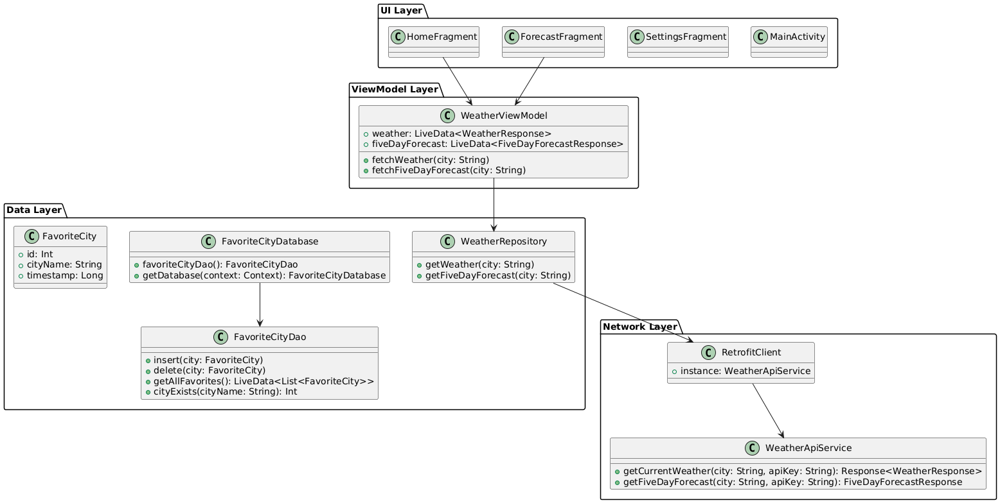
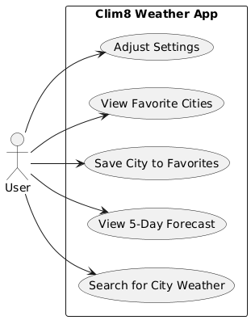

# Clim8 Part 2 Documentation ☀️


## Current State of Project

### Technical Details and Design Decisions:
- **Dark Theme**: Dark gray, purple, and white chose for both better battery efficiency and modern aesthetics.
- **OpenWeatherMap REST API**: Chosen for its detailed and relible weather data, as well as ease of integration.
- **Room Database**: Used to store simple user settings like temperature units and notification preferences.
- **SharedPreferences**: Used to store simple user settings like temperature units and notification preferences.
- **Navigation**: Bottom navigation is used for a simple and intuitive page structure (Home, Forecast, and Settings).
- **Modern Android Practices**: We use **FragmentContainerView**, View Binding and Coil for image loading.

---

## Chosen Architectureal Pattern

**Chosen Pattern**: Model-View-ViewModel (MVVM)

### Why?
- **Separation of Concerns**: MVVM cleanly separates the UI (view), business logic (ViewModel), and data (Model).
- **Reactivity**: LiveData in the ViewModel automatically updates the UI when data changes. Like when new weather data is fetched for a new city.
- **Testability**: ViewModels are easier to unit-test because they don't directly depend on Android Views.
- **Scalability**: As features like background updates, notifications, and complex settings grow, MVVM helps keep code in a much more manageable state.

### How MVVM is used in Clim8:
- **Model**: ```WeatherResponse.kt```, ```FavoriteCity.kt```, ```FavoriteCityDao.kt```, etc., represent app data and database entitites.
- **ViewModel**: ```WeatherViewModel.kt``` handles API calls, updates LiveData, and holds UI state.
- **View (UI)**: ```HomeFragment.kt```, ```ForecastFragment.kt```, and ```SettingsFragment.kt``` observe LiveData and display information.

---

## Rest API & Database Design

### REST API:
- *API Used*: OpenWeatherMap
- *Base URL*: https://api.openweathermap.org/data/2.5/
- *Endpoint Used*: ```weather```
- *Example Request*: ```
                     https://api.openweathermap.org/data/2.5/weather?q={city name}&appid={API key}&units=metric
                     ```
- *Response Data*:
    - Temperature (Celsius by default)
    - Weather description
    - Humidity
    - Pressure
    - Wind speed
    - City Name
    - Weather icon URL

### Database Design (Room)

**Table**: FavoriteCity
- ```id: Int``` (Primary Key, auto generated)
- ```cityName: String```

**DAO Operations**:
- Insert City
- Check if city exists (to protect against duplicates)
- Delete city
- Retrieve all favorite cities (as LiveData)

** SharedPreferences Design**:
- Stores:
  - Temperature unit preference (Celsius/farenheit)
  - Notifications enabled/disabled
  - Update frequency (in hours)

---

## UML Diagrams

### Class Diagram


---

### Use Case Diagram

